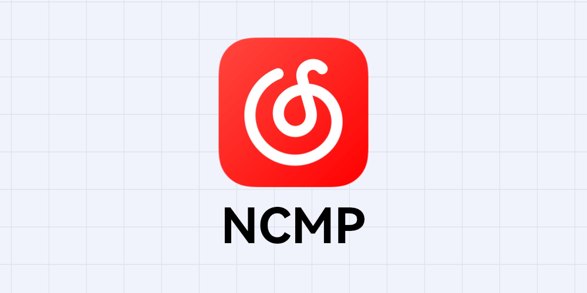

<h1 align="center">NonsPlayer Adapter Ncm</h1>

 
  NonsPlayer的网易云适配器

# 食用方法

## 方法1

## 方法2

将dll文件拖拽到`AppData\Local\NonsPlayer\adapters`中，重启NonsPlayer即可

# 特别说明

本仓库仅作为适配器的**发布仓库**, 源代码不予公开

适配器内容均调用官方API, 程序不提供任何形式的破解、免费收听等功能。

禁止对本程序进行反编译、反汇编、反向工程等行为。
